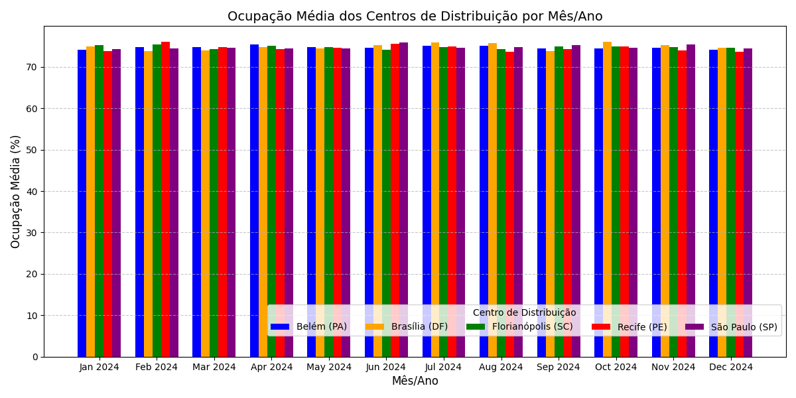
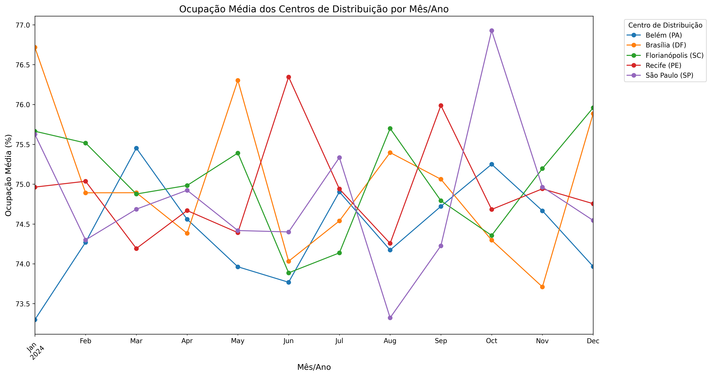
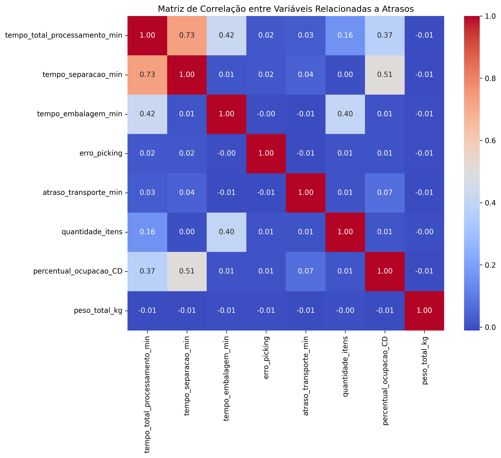
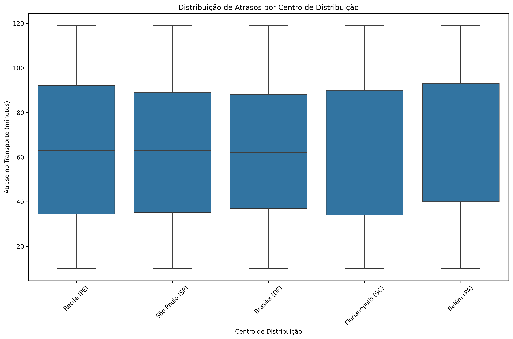
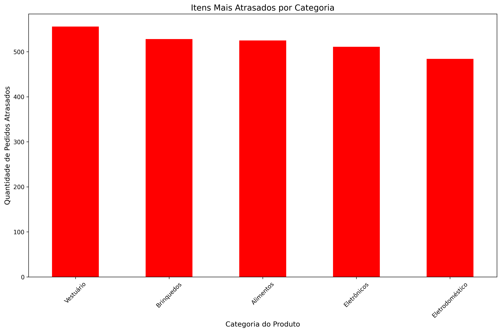
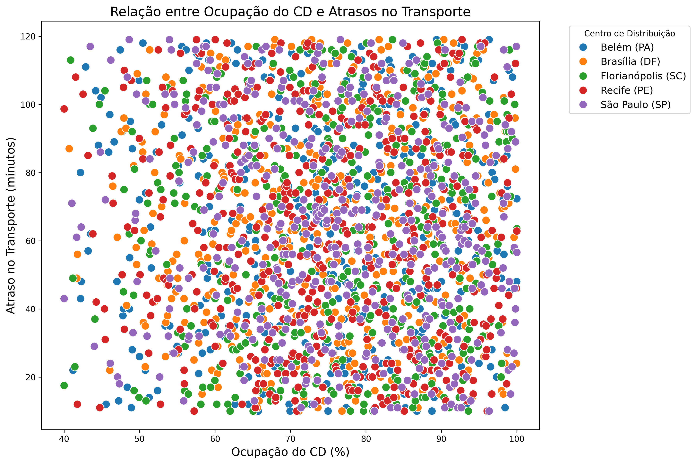
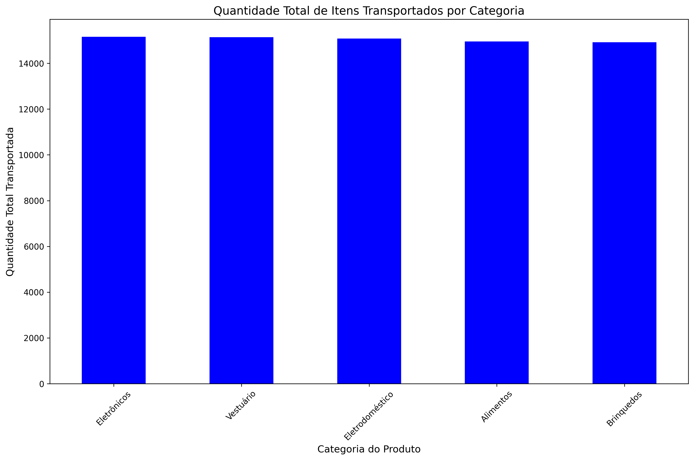

# Análise de Dados Logísticos

### Ocupação Média dos Centros de Distribuição por Mês/Ano

- Arquivo: `ocupacao_media_cd_por_mes.png`
- Objetivo: Identificar sazonalidades e períodos de alta ocupação nos centros de distribuição.

### Matriz de Correlação entre Variáveis Relacionadas a Atrasos

- Arquivo: `matriz_correlacao_atrasos.png`
- Objetivo: Analisar relações entre tempo de processamento, atrasos no transporte e quantidade de itens.

### Distribuição de Atrasos por Centro de Distribuição

- Arquivo: `distribuicao_atrasos_por_cd.png`
- Objetivo: Identificar variações nos atrasos entre diferentes CDs.

### Boxplots para Variáveis Críticas

- Arquivo: `boxplots_variaveis_criticas.png`
- Objetivo: Identificar outliers (valores atípicos) na distribuição dos dados, visando oportunidades de melhoria nos processos e a detecção de variações nos tempos de expedição/logística conforme a ocupação do CD.

### Itens Mais Atrasados por Categoria

- Arquivo: `itens_atrasados_por_categoria.png`
- Objetivo: Determinar quais categorias de produtos enfrentam mais problemas logísticos.

### Relação entre Ocupação do CD e Atrasos no Transporte

- Arquivo: `relacao_ocupacao_atrasos.png`
- Objetivo: Avaliar se a ocupação do CD afeta os atrasos no transporte.

### Relação entre Categorias de maior atraso por CDs

| CD                 | Categoria com maior atraso | Arquivo                                                                                                                             |
| ------------------ | -------------------------- | ----------------------------------------------------------------------------------------------------------------------------------- |
| Belém (PA)         | Eletrônicos                | <a href="../resources/images/relacao_categorias_atraso_Belem_(PA).png">relacao*categorias_atraso_Belem*(PA).png</a>                 |
| Brasília (DF)      | Vestuário                  | <a href="../resources/images/relacao_categorias_atraso_Brasilia_(DF).png">relacao*categorias_atraso_Brasilia*(DF).png</a>           |
| Florianópolis (SC) | Brinquedos                 | <a href="../resources/images/relacao_categorias_atraso_Florianopolis_(SC).png">relacao*categorias_atraso_Florianopolis*(SC).png</a> |
| Recife (PE)        | Alimentos                  | <a href="../resources/images/relacao_categorias_atraso_Recife_(PE).png">relacao*categorias_atraso_Recife*(PE).png</a>               |
| São Paulo (SP)     | Vestuário                  | <a href="../resources/images/relacao_categorias_atraso_Sao_Paulo_(SP).png">relacao*categorias_atraso_Sao_Paulo*(SP).png</a>         |

### Quantidade Total de Itens Transportados por Categoria

- Arquivo: `quantidade_itens_transportados_por_categoria.png`
- Objetivo: Identificar categorias com maior volume de transporte.
